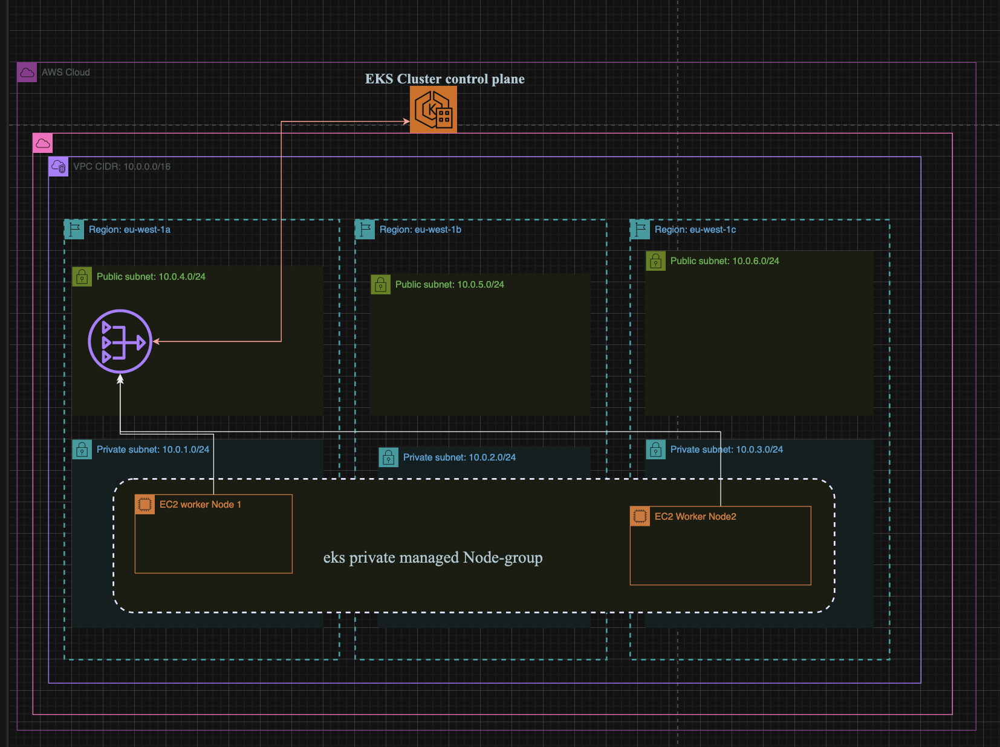

# Terraform AWS EKS Setup 

This repository contains Terraform configurations to set up an AWS EKS (Elastic Kubernetes Service) cluster for the "MyApp" application. The infrastructure is defined using Terraform modules for VPC and EKS.

## Project Structure

- **vpc.tf**: Defines the AWS VPC (Virtual Private Cloud) using the `terraform-aws-modules/vpc/aws` module.
- **eks-cluster.tf**: Sets up the AWS EKS cluster using the `terraform-aws-modules/eks/aws` module.

## Network creates with this Terraform

  
## Prerequisites

Before you begin, make sure you have the following:

- AWS CLI installed and configured with the necessary credentials.
- Terraform installed on your local machine.

## Configuration

### vpc.tf

- **Variables:**
  - `vpc_cidr_block`: CIDR block for the VPC.
  - `private_subnet_cidr_blocks`: CIDR blocks for private subnets.
  - `public_subnet_cidr_blocks`: CIDR blocks for public subnets.

- **Module Configuration:**
  - `name`: Name of the VPC.
  - `cidr`: CIDR block for the VPC.
  - `private_subnets`: CIDR blocks for private subnets.
  - `public_subnets`: CIDR blocks for public subnets.
  - `azs`: Availability zones retrieved dynamically.
  - `enable_nat_gateway`: Enable NAT gateways for private subnets.
  - `single_nat_gateway`: Use a single NAT gateway for all private subnets.
  - `enable_dns_hostnames`: Enable DNS hostnames for instances.

- **Tags:**
  - Tags are set for identifying resources related to the EKS cluster.

### eks-cluster.tf

- **Provider Configuration:**
  - Configures the Kubernetes provider with information from the EKS cluster.

- **Data Sources:**
  - `aws_eks_cluster`: Retrieves information about the EKS cluster.
  - `aws_eks_cluster_auth`: Retrieves authentication details for the EKS cluster.

- **Module Configuration:**
  - `cluster_name`: Name of the EKS cluster.
  - `cluster_version`: Kubernetes version for the EKS cluster.
  - `subnet_ids`: Private subnet IDs for EKS worker nodes.
  - `vpc_id`: VPC ID where the EKS cluster is deployed.

- **Node Group Configuration:**
  - Defines an EKS managed node group for the development environment.

## Usage

1. Clone this repository to your local machine.
2. Navigate to the project directory in your terminal.
3. Run `terraform init` to initialize the Terraform configuration.
4. Run `terraform apply` to create the AWS infrastructure.
5. Confirm the changes by typing `yes` when prompted.
6. Once the setup is complete, Kubernetes configuration files will be generated.

## Cleanup

To destroy the infrastructure and release AWS resources:

1. Run `terraform destroy`.
2. Confirm the destruction by typing `yes` when prompted.

## Additional Information

- For more details on the Terraform AWS VPC module, refer to [terraform-aws-modules/vpc/aws](https://registry.terraform.io/modules/terraform-aws-modules/vpc/aws/latest).
- For more details on the Terraform AWS EKS module, refer to [terraform-aws-modules/eks/aws](https://registry.terraform.io/modules/terraform-aws-modules/eks/aws/latest).

